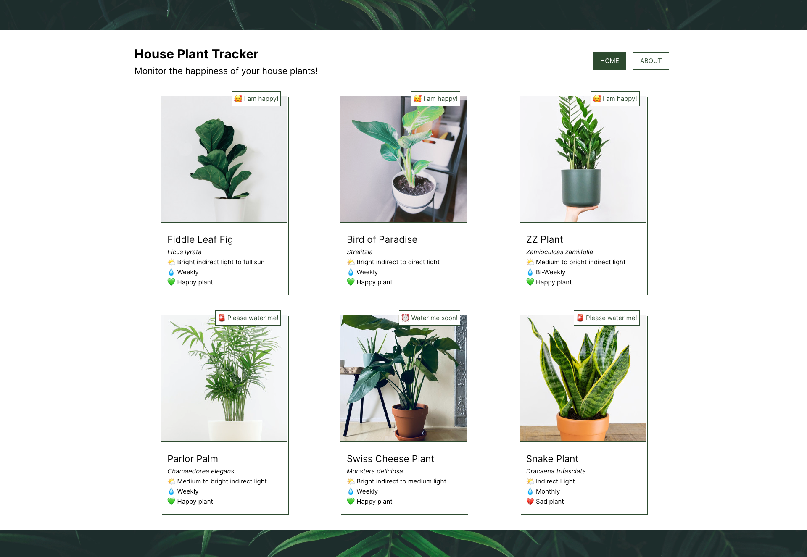
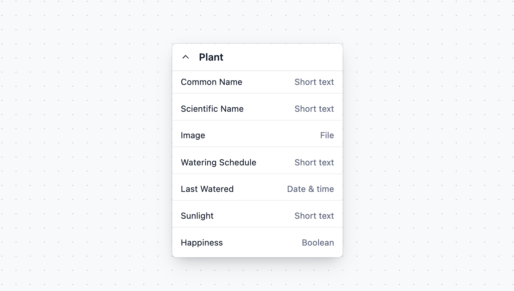

# Contentful Vue Starter

Create a simple house plant tracker with [Contentful](https://contentful.com) and [Vue.js](https://vuejs.org/).

## Demo

[Live Demo](https://vue-plant-tracker.vercel.app/)



## Features

- Built with Vue 3 and Vite.
- Simple content model and structure. Easy to adjust to your needs.
- Uses the [Contentful GraphQL API](https://www.contentful.com/developers/docs/references/graphql/) to fetch the content.

## Quick Start

Follow the steps mentioned below to set up and run the project quickly. For more detailed instructions, follow the steps mentioned in [Configuration](#configuration).

### Step 1. Create an account and a space on Contentful

First, [create an account on Contentful](https://www.contentful.com/sign-up/).

After creating an account, create a new empty **space** from the [dashboard](https://app.contentful.com/) and assign to it any name of your liking.

### Step 2. Get the source code and install dependencies

Access the source code by cloning this repository.

```sh
git clone https://github.com/contentful/starter-vue-tracker.git
```

Or by [downloading](https://github.com/contentful/vue-starter/archive/main.zip) as a zip file.

Once downloaded, in your terminal run 

```sh
npm install
```

### Step 3. Set up the content model

The starter comes with a Contentful set up command that imports the required content model and adds sample content to your space.

The command asks you for a [Space ID](https://www.contentful.com/help/find-space-id/), [Content Management API Access Token](https://www.contentful.com/developers/docs/references/content-management-api/), and the [Conetnt Delivery API Access Token](https://www.contentful.com/developers/docs/references/content-delivery-api/).

In your terminal, navigate in to the project directory. Run the following command to set up the content model.

```sh
npm run setup
```

When prompted, enter the above mentioned details in the terminal respectively.

### Step 4. Run it locally

Execute the following command.

```sh
npm run dev
```

Navigate to ``localhost:5173`` to view the site.

## Configuration

### Step 1. Create an account and a space on Contentful (skip if you already have an account)

First, [create an account on Contentful](https://www.contentful.com/sign-up/).

After creating an account, create a new empty **space** from the [dashboard](https://app.contentful.com/) and assign to it any name of your liking.

### Step 2. Create a content model

The [content model](https://www.contentful.com/developers/docs/concepts/data-model/) defines the data structures of your application/websites. The structures are flexible and you can tailor them to your needs.

For this example you need to create a content model that defines a plant. **You can create them automatically by using this starter or by doing it manually** to familiarize yourself with the Contentful user interface.

#### Create the content model manually

##### Create a `Plant` content type

From your Contentful space, go to **Content model** and add a new content type:

- Give it the **Name** `Plant`, the **Api Identifier** should be `plant`

Once the content model is saved, add these fields (you don't have to modify the settings unless specified):

- `Common Name` - **Text** field (type **short text**).
    - Under **Field Options** in Settings, check ***This field represents the Entry title***
- `Scientific Name` - **Rich Text** field.
- `Image` - **Media** field.
- `Last Watered` - **Date & time** field.
- `Watering Schedule` - **Short Text** field.
- `Sunlight` - **Short Text** field.
- `Happiness` - **Boolean** field.

Save the content type and continue.

### Step 3. Validate your content model

After setting up the content model, it should look as follows.

**Content model overview**



### Step 4. Populate Content

Go to the **Content** section in your space, then click on **Add entry** and select the **Plant** content type:

**Important:** For each entry and asset, you need to click on **Publish**. If not, the entry will be in draft state.


### Step 5. Set up environment variables

From your contentful space, go to **Settings > API keys**. Create a new API key.

If you ran `npm run setup` a `.env` file was created for you. If not, create a `.env` file (which will be ignored by Git):

Then set each variable in `.env`:

- `VITE_CONTENTFUL_SPACE_ID` should be the **Space ID** field of your API Key
- `VITE_CONTENTFUL_ACCESS_TOKEN` should be the **[Content Delivery API](https://www.contentful.com/developers/docs/references/content-delivery-api/) - access token** field of your API key

Your `.env` file should look like this:

```bash
VITE_CONTENTFUL_SPACE_ID=...
VITE_CONTENTFUL_ACCESS_TOKEN=...
```

### Step 6. Run in development mode

```bash
npm install
npm run dev
```

Your app should be up and running on [http://localhost:5173](http://localhost:5173)!

## Deploy

To deploy, run the following command and commit your changes to GitHub.

```bash
npm run build
```

Chose your favorite hosting provider such as Netlify or Vercel and create a new project. 

**NOTE:** You'll have to configure the ***VITE_CONTENTFUL_SPACE_ID*** and ***VITE_CONTENTFUL_ACCESS_TOKEN*** values.
